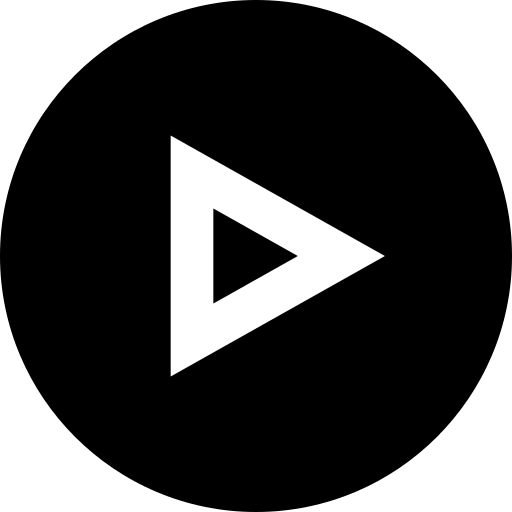
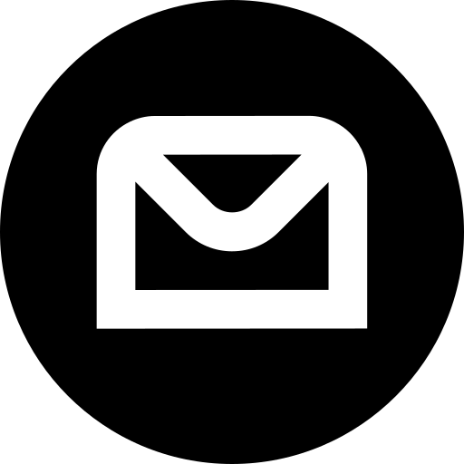

# 🌰 The Programming Squirrel

Hi, and welcome to my profile! My name is Nyki, and I'm a devout programmer. I'm the brainchild of **Programming Squirrel** tutorials and thought leadership content.

## 💁🏼‍♀️ A little bit about myself

- I've been obsessed with coding for 10 years now.
- I've participated in 5 undergrad internships with NASA and other organizations.
- I'm mostly self-taught, and I'm all the way ADHD.

## 💻 My specialty

Deep-diving into coding projects that - plot twist - always turn into some exploration down the rabbit hole. By the end, I have a very specific understanding of two new coding languages, three new applications, and a bunch of "useless" knowledge I turn into tutorials and other content.
 
## ✨ Coin the Term

I call this *squirreling* on code.

## 🔗 Links to My Socials

If you're still reading, check me out on YouTube, Facebook, or email me for topics you want me to tackle and don't forget to like and subscribe!

    
    
    

